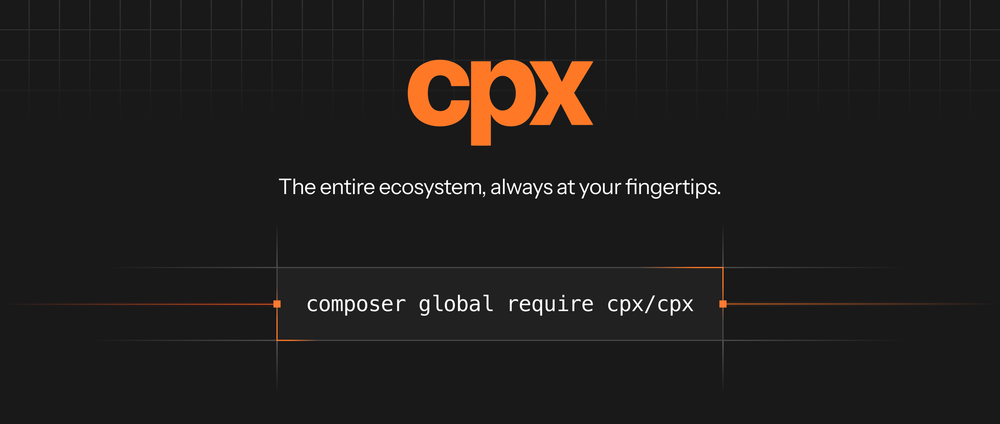

# cpx - Composer Package Executor

Run any command from any composer package, even if it's not installed in your project.

cpx is to Composer what npx is to npm.

## Installation

Install cpx globally with Composer:

```bash
composer global require cpx/cpx
```

Make sure Composer's global `bin` directory is on your `PATH` (you can find it with `composer global config bin-dir --absolute`) so you can run `cpx` from anywhere.

Upgrade to the latest release at any time by running:

```bash
composer global update cpx/cpx
```

## Usage

You can run a command using cpx by passing through the package name and the command you want to run:

> Note: A package name is what you'd use to require the package in your `composer.json` file, e.g. `friendsofphp/php-cs-fixer`
> You can also use constraints to specify a version, e.g. `friendsofphp/php-cs-fixer:^3.0`

```bash
cpx <package-name> <command> [arguments]
# Example: cpx friendsofphp/php-cs-fixer php-cs-fixer fix ./src
```

If the package only has one command, or the command name is the same as the package's name, you can omit the command from the end:

```bash
cpx <package-name> [arguments]
# Example: cpx friendsofphp/php-cs-fixer fix ./src
```

Behind the scenes, cpx will install the package into a separate directory and run the command, keeping it separate from both your project and global Composer dependencies (unless the package is already installed in your project — see below). Subsequent runs of the same package will use the same installation and run quickly, unless you specify a different version or there is an update to the package available.

### Local package directories

When developing a Composer package locally, pass its directory to run its declared binary directly from the source checkout:

```bash
cpx /absolute/path/to/package --version
cpx ~/path/to/package --version
cpx ./path/to/package --version
cpx ../path/to/package --version
```

The directory must contain a valid `composer.json` and its dependencies must already be installed at `vendor/autoload.php`. For packages with multiple binaries, pass the binary name after the directory just as you would after a package name:

```bash
cpx ../package binary-name --flag
```

cpx does not run Composer, copy the package, cache it, or include it in package maintenance commands when an explicit local directory is used. Run `composer install` in the package directory yourself whenever its dependencies need to be installed.

### Local project binaries

Like `npx`, cpx prefers a binary that is already installed in your project. Before installing an isolated copy, cpx finds the nearest Composer project (walking up from the current directory) and runs the matching binary from its configured `bin-dir` (`vendor/bin` by default):

```bash
cpx pint                 # runs vendor/bin/pint when the project has it installed
cpx phpunit --filter=Foo # runs vendor/bin/phpunit when present
cpx laravel/pint:^2.0    # uses the local pint only when the installed version satisfies ^2.0
```

This keeps cpx aligned with the versions your project pins. When no matching local binary is found, cpx falls back to installing and running an isolated copy.

To skip the local binary and force the isolated copy, pass `--skip-local` before the package:

```bash
cpx --skip-local laravel/pint --version
```

---

### cpx alias

`cpx alias` lets you create your own shortcut for a package, so you don't have to remember or type its full vendor/package name every time.

```
cpx alias laravel/pint pint
```

Both arguments are optional — if you leave either one out, cpx will prompt you for it. Leaving out the name defaults it to the package's short name, so `cpx alias laravel/pint` alone is enough to create the `pint` alias above.

Your aliases are saved under `~/.cpx/` and can be listed with `cpx aliases`.

Use `cpx unalias <name>` to remove one of your aliases, e.g. `cpx unalias pint`. Leave off the name and cpx will prompt you for it.

### cpx installed

`cpx installed` shows all the packages you have run via cpx and have installed. Running `cpx` with no arguments (or `cpx list`) shows every available cpx command.

### cpx update

While cpx will automatically check for updates to a Composer package when you run a command, you can also manually update packages.

`cpx update` will update the local version of all packages run via cpx to the latest version, according to their version constraints.

`cpx update <vendor>` or `cpx update <vendor>/<package>` will update only the specified packages.

### cpx clean

`cpx clean` will remove all the packages you have run via cpx but haven't used recently. `cpx clean --all` will remove all packages regardless of when they have run.

### cpx exec and cpx tinker

cpx gives you multiple ways to run PHP code quickly, perfect for running scratch files or quickly running code in your project.

- `cpx exec <file.php>` will run a plain PHP file. This is the only way to run a file — a bare `cpx <file.php>` is not routed to exec.
- `cpx exec -r <raw php code>` will execute the given PHP code.
- `cpx exec <gist url>` will download a GitHub gist (like `https://gist.github.com/user/id`) and run it, similar to how npx can run gists. For gists with multiple PHP files, cpx asks which one to run — or append the file's anchor from the gist page (like `#file-my-script-php`) to skip the prompt. You can pin a specific revision by appending its SHA to the URL (like `/5c30e34c...`), and set a `GITHUB_TOKEN` environment variable to authenticate if you hit GitHub's rate limit. Raw gist links (the gist page's "Raw" button, like `https://gist.githubusercontent.com/user/id/raw/.../script.php`) also work and are downloaded exactly as pinned. The script executes against your current directory, so autoloading and framework bootstrapping still apply.
- `cpx tinker` will open an interactive REPL in the terminal for your project.

When using these commands, you get the following benefits:

- **Automatic Autoloaders** - When running a PHP file, it will automatically detect and use Composer's autoloader if it exists in the current or a parent directory
- **Class Aliasing** - If a class is used in the file but the namespace isn't imported, cpx will try to find an appropriate one to alias.
- **Framework Bootstrapping** - In a Laravel project, cpx fully boots the application (config, facades, and `.env` all work, with `$app` in scope). In a Symfony project, it boots the kernel and exposes `$kernel` and `$container`. Pass `--no-boot` to skip the framework boot.
- **The right REPL** - In a Laravel project with `laravel/tinker` installed, `cpx tinker` runs your project's own `php artisan tinker` (extra arguments like `--execute` are forwarded). Everywhere else it opens a PsySH shell with your project booted.
- **Process isolation** - Your code runs in its own PHP process, so it never collides with cpx's bundled dependencies, and `exit()` codes pass through.
- **cpx_require()** - You can use the function like `cpx_require('vendor/package')` in the executed script and those packages will be autoloaded into the file. The function is also available inside `cpx tinker`, including when it proxies to your project's own `artisan tinker`.

### cpx help

`cpx help` shows usage information, and `cpx help <command>` shows help for a specific command.

### Non-interactive mode and JSON output

cpx detects when it is not running in an interactive terminal — inside an AI agent (via [laravel/agent-detector](https://github.com/laravel/agent-detector)), with stdin redirected, or when `--no-interaction`/`-n` is passed. In non-interactive mode:

- Child processes never get a TTY.
- Prompts fall back to their defaults instead of waiting for input — pass positional arguments and `--bin` to control everything explicitly. Overwriting an existing alias with `cpx alias` requires the `--force` option and fails otherwise.
- cpx's own commands (`installed`, `aliases`, `alias`, `unalias`, `clean`, and `update`) respond with a single line of JSON instead of formatted text:

```json
{
    "success": true,
    "errors": [],
    "summary": {
        "packages": [
            { "name": "laravel/pint", "last_run": "2024-01-02 03:04:05" }
        ]
    }
}
```

Package runs stream only the tool's own output — cpx's progress rendering is suppressed — and cpx-level failures (an unrecognised command, a package that cannot be installed, missing or ambiguous binaries) are reported as JSON.

You can also pass `--json` to any of the commands above to get the same JSON output from an interactive terminal.

## FAQ:

### Why not just install every tool with global composer?

Installing individual tools with `composer global require` works, but it has some downsides:

- You can get conflicts with other global dependencies (especially tooling using common dependencies like `nikic/php-parser` and `symfony/console`)
- You might need to switch between versions of the package between runs, but can only have one version installed globally
- You need to remember to update your global packages if you are using them long-term
- You might only use a package's command once, and don't want to install it globally

cpx itself is safe to install with `composer global require` because it has no runtime Composer dependencies of its own — it ships as a self-contained PHAR (see below), so it doesn't add to the global dependency conflict surface.

### What kind of one-off commands might I want to run with cpx?

There are a few reasons you might want to run a one-off command with cpx:

- Applying code-style fixes using a tool like `php-cs-fixer` or `rector`
- Running analysis of your codebase using a tool like `phploc` or `phpstan`
- Creating files or stubs using a tool like `laravel/installer`

### Can I use multiple different versions of a tool with cpx?

Yes, cpx will manage the package versions for you, so you can run any version of the package you want.

### Does cpx conflict with my project or global Composer dependencies?

No. cpx ships as a self-contained PHAR with its own runtime dependencies bundled and isolated inside it, kept separate from both your project and your global Composer setup. Avoiding those conflicts is one of the problems cpx is built to solve.

## Credits

- [Liam Hammett](https://github.com/imliam)
- [All Contributors](https://github.com/laravel/cpx/contributors)
